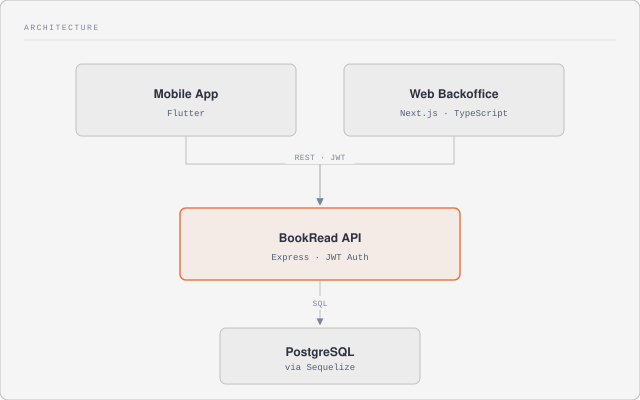

# BookRead

BookRead is a reading-tracking platform built as a university final project. Users log the books they're reading, track pages/time read, set daily and yearly reading goals, take notes, and keep streaks — all from a mobile app backed by a shared API, with a web backoffice for administration.

The project is split into three independent apps that share one backend:

| Part | Folder | Stack |
|---|---|---|
| Backend API | [`api/`](./api) | Node.js, Express, Sequelize, PostgreSQL |
| Mobile app | [`mobile/`](./mobile) | Flutter |
| Admin backoffice | [`web-backoffice/`](./web-backoffice) | Next.js, TypeScript |

## Features

**Mobile app (end users)**
- Sign up / log in
- Personal library with reading statuses: wanted, reading, read, archived
- Add/search books, rate and take notes on them
- Reading session timer and reading logs (pages/time per session)
- Daily and yearly reading goals, with progress and streaks
- Push notifications and reminders
- Multi-language support, light/dark themes
- Offline-aware screens

**Admin backoffice (web)**
- Admin login
- Book management (`livros`)
- Reading activity overview (`leituras`)
- User management (`utilizadores`)
- Usage statistics and charts (`estatisticas`)
- Admin profile (`perfil`)

**Backend API**
- JWT-based authentication (user and admin)
- REST endpoints for books, reading logs, notes, goals, settings, stats and activity logs
- PostgreSQL persistence via Sequelize, with a full Jest test suite running against an in-memory SQLite database

## Architecture

<picture>
  <source media="(prefers-color-scheme: dark)" srcset="./docs/architecture-dark.svg">
  
</picture>

Both clients talk to the same REST API. The mobile app is the primary user-facing product; the web backoffice is an internal admin tool for managing books, users and reading data.

## Getting started

Clone the repo, then set up each part independently — see each folder's own `README.md` for details (env vars, scripts, etc.).

```bash
git clone https://github.com/goncalopereira13k/BookRead.git
cd BookRead

# Backend — needs a running PostgreSQL instance and a .env with JWT_SECRET / DB_PASSWORD
cd api && npm install && npm start

# Admin web backoffice
cd web-backoffice && npm install && npm run dev

# Mobile app — point it at your API with --dart-define=API_BASE_URL=...
cd mobile && flutter pub get && flutter run
```

## Project structure

```
BookRead/
├── api/              # Backend REST API (Express + PostgreSQL)
├── web-backoffice/   # Admin/backoffice web app (Next.js)
└── mobile/           # Mobile app (Flutter)
```

## Authors

- Gonçalo Pereira
- Diogo Correia

## License

MIT — see [LICENSE](./LICENSE).
